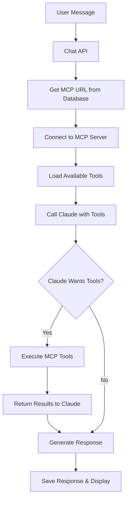

# MCP (Model Context Protocol) Integration with Browser0

## Overview

Browser0 now includes **full MCP integration** with the Microsoft Playwright MCP server, enabling AI-powered browser automation. This integration allows Claude (our AI assistant) to directly control browsers through structured commands, providing intelligent web automation capabilities.

## Architecture

### Key Components

1. **MCP Client (`app/utils/mcp.server.ts`)** - Connects to Playwright MCP servers
2. **Enhanced Anthropic Integration (`app/utils/anthropic.server.ts`)** - Passes MCP tools to Claude
3. **Browser Creation (`app/utils/browserize.server.ts`)** - Provisions browsers with MCP endpoints
4. **Database Integration** - Stores MCP URLs for each chat session

### How It Works



## Features

### Supported Browser Actions

The MCP integration provides access to all Playwright browser automation capabilities:

#### **Navigation & Page Control**
- `browser_navigate` - Navigate to URLs
- `browser_navigate_back` - Go back in history
- `browser_navigate_forward` - Go forward in history
- `browser_close` - Close browser
- `browser_resize` - Resize browser window

#### **Page Analysis & Capture**
- `browser_snapshot` - Get accessibility tree (structured page data)
- `browser_take_screenshot` - Capture page screenshots
- `browser_network_requests` - Get network activity
- `browser_console_messages` - Get console logs

#### **Element Interaction**
- `browser_click` - Click elements using accessibility references
- `browser_hover` - Hover over elements
- `browser_type` - Type text into input fields
- `browser_select_option` - Select dropdown options
- `browser_drag` - Drag and drop operations

#### **Advanced Actions**
- `browser_press_key` - Keyboard input
- `browser_wait_for` - Wait for conditions
- `browser_file_upload` - Upload files
- `browser_handle_dialog` - Handle alerts/dialogs
- `browser_pdf_save` - Save page as PDF

### Key Advantages

1. **Accessibility-First**: Uses browser accessibility tree instead of visual recognition
2. **Fast & Reliable**: No screenshot processing required
3. **Structured Data**: Returns JSON data that Claude can easily understand
4. **Deterministic**: Element references ensure consistent interactions
5. **Comprehensive**: Full Playwright API coverage

## Usage Examples

### Basic Website Navigation

**User:** "Go to google.com and search for 'MCP protocol'"

**AI Response:** The AI will:
1. Navigate to google.com using `browser_navigate`
2. Take a page snapshot to see the search form
3. Type "MCP protocol" in the search field using `browser_type`
4. Submit the search
5. Report the results

### Form Automation

**User:** "Fill out the contact form on example.com with my information"

**AI Response:** The AI will:
1. Navigate to the contact form
2. Analyze the page structure with `browser_snapshot`
3. Fill each field using `browser_type`
4. Submit the form using `browser_click`

### Data Extraction

**User:** "Get me the headlines from news.ycombinator.com"

**AI Response:** The AI will:
1. Navigate to the site
2. Get page accessibility data
3. Extract headline text and links
4. Return structured information

## Configuration

### Environment Variables

Ensure these are set in your `.env` file:

```bash
# Required for browser provisioning
BROWSERIZE_API_KEY=your_browserize_api_key

# Required for AI responses
ANTHROPIC_API_KEY=your_anthropic_api_key

# Database connection
DATABASE_URL=postgresql://postgres:password@db:5432/browser0
```

### MCP Connection Settings

The MCP client is configured with robust connection handling:

```typescript
{
  maxRetries: 3,        // Connection retry attempts
  retryDelay: 2000,     // Delay between retries (ms)
  connectionTimeout: 15000  // Connection timeout (ms)
}
```

## Security Features

### Input Validation
- URL format validation
- Parameter sanitization
- Tool existence verification
- Argument type checking

### Connection Security
- Automatic client cleanup (30-minute timeout)
- Connection retry limits
- Error boundary protection
- Secure argument handling

### Rate Limiting
- Built-in retry backoff
- Connection attempt tracking
- Resource cleanup

## Troubleshooting

### Common Issues

#### "Failed to connect to MCP server"
**Cause:** Browser not fully provisioned or MCP server not ready
**Solution:** 
- Wait 10-30 seconds after chat creation
- Check browser status in database
- Verify BROWSERIZE_API_KEY is correct

#### "Tool not found" errors
**Cause:** MCP server not properly connected
**Solution:**
- Check MCP URL format in database
- Verify browser is running
- Check server logs for connection errors

#### "Connection timeout"
**Cause:** Network issues or server overload
**Solution:**
- Try again (automatic retry will occur)
- Check internet connectivity
- Verify Browserize service status

### Debugging

#### Enable Debug Logging
```typescript
// In mcp.server.ts, uncomment debug logs
console.log('MCP Debug:', ...);
```

#### Check MCP Connection Health
```typescript
import { healthCheckMCPClient } from '~/utils/mcp.server';

const health = await healthCheckMCPClient(mcpUrl);
console.log('MCP Health:', health);
```

#### Monitor Connected Clients
```typescript
import { getConnectedClientsCount } from '~/utils/mcp.server';

console.log('Active MCP connections:', getConnectedClientsCount());
```

## API Reference

### MCPPlaywrightClient Class

#### Core Methods
- `connect(mcpUrl: string)` - Connect to MCP server
- `disconnect()` - Close connection
- `callTool(name: string, args: any)` - Execute MCP tool
- `getAvailableTools()` - List available tools
- `isConnected()` - Check connection status

#### Browser Automation Methods
All high-level browser methods include validation and error handling:

```typescript
// Navigation
await client.navigateToUrl('https://example.com');
await client.goBack();
await client.goForward();

// Page Analysis
const snapshot = await client.getPageSnapshot();
const screenshot = await client.takeScreenshot();

// Element Interaction
await client.clickElement('Submit button', 'button-ref-123');
await client.typeText('Email field', 'input-ref-456', 'user@example.com');

// Advanced Actions
await client.waitFor(2); // Wait 2 seconds
await client.pressKey('Enter');
await client.resizeBrowser(1280, 720);
```

## Best Practices

### For Users
1. **Be Specific**: "Click the blue submit button" vs "click submit"
2. **Wait for Pages**: Allow time for dynamic content to load
3. **Provide Context**: Mention what you expect to see/happen
4. **Error Recovery**: If something fails, describe what went wrong

### For Developers
1. **Error Handling**: Always wrap MCP calls in try/catch
2. **Resource Cleanup**: Use connection timeouts
3. **Validation**: Validate all inputs before MCP calls
4. **Logging**: Include detailed logs for debugging
5. **Testing**: Test with various website types

## Performance Considerations

### Connection Management
- Connections are cached and reused per chat
- Automatic cleanup after 30 minutes
- Connection pooling prevents resource leaks

### Tool Execution
- Fast execution due to accessibility tree usage
- No screenshot processing overhead
- Structured data responses

### Scaling
- Each chat gets its own browser instance
- MCP connections are isolated per chat
- Database stores all browser session data

## Known Limitations

1. **Website Compatibility**: Some sites may have poor accessibility markup
2. **Dynamic Content**: Very dynamic sites may need wait strategies
3. **File Uploads**: Local file access may be limited in containerized environments
4. **Browser Resources**: Each chat consumes a browser instance

## Future Enhancements

1. **Vision Mode**: Add support for coordinate-based interactions
2. **Multi-tab Support**: Handle multiple browser tabs
3. **Advanced Selectors**: CSS/XPath selector support
4. **Browser Profiles**: Persistent login sessions
5. **Batch Operations**: Multiple actions in single requests

## References

- [Model Context Protocol Specification](https://modelcontextprotocol.io/)
- [Microsoft Playwright MCP Server](https://github.com/microsoft/playwright-mcp)
- [Anthropic Claude API Documentation](https://docs.anthropic.com/)
- [Browserize API Documentation](https://browserize.com/docs)

---

**Need Help?** Check the troubleshooting section above or review the server logs for detailed error information. 